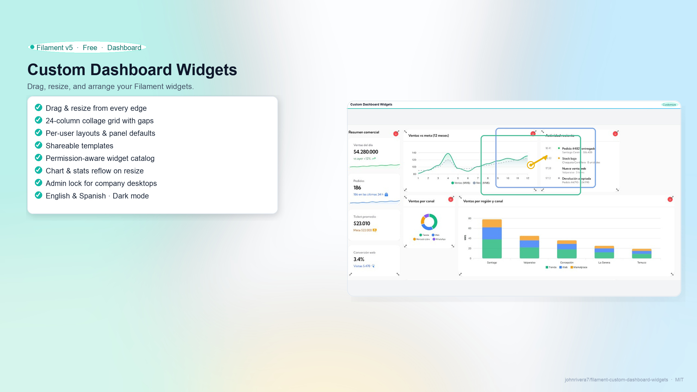
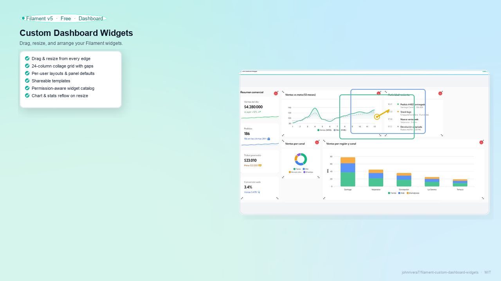
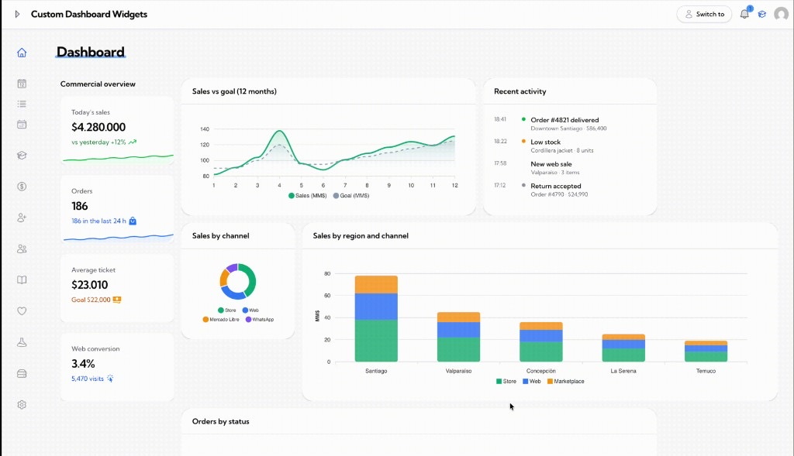
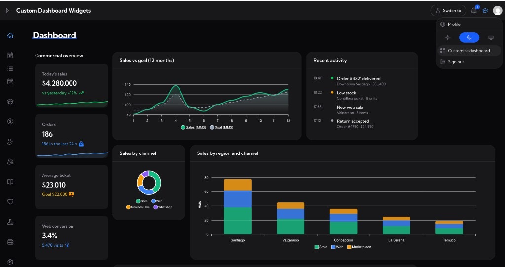
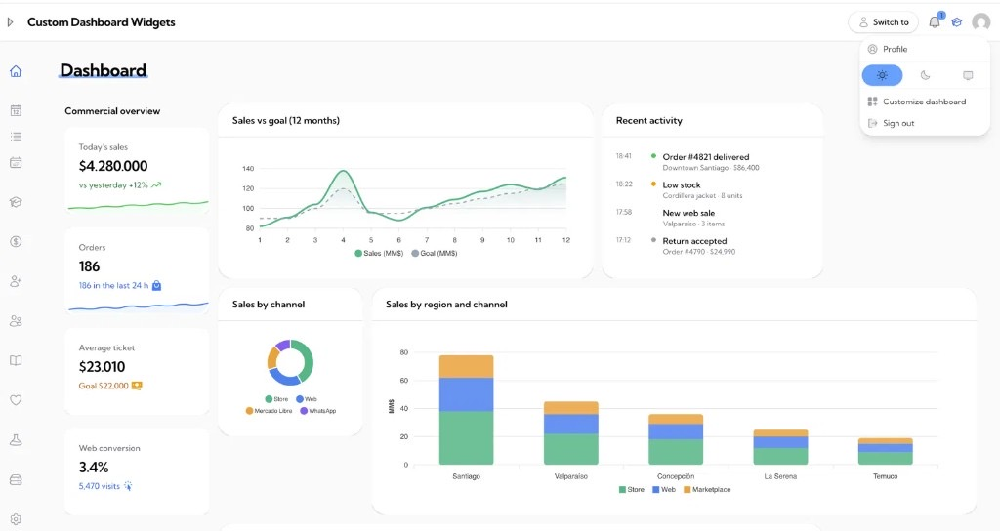
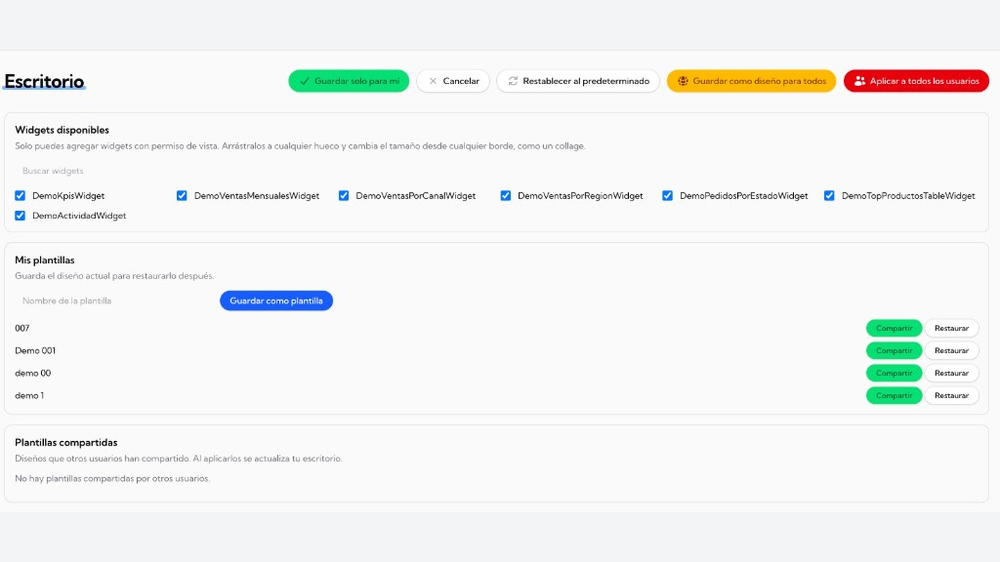

<div class="filament-hidden">



# Custom Dashboard Widgets

</div>

# Custom Dashboard Widgets


**Customize Filament dashboards: drag, resize, and arrange widgets.**

Give every Filament user a personal desktop: add widgets, drag them into place, resize from any edge, and save the layout. Your existing Filament widgets keep working — this plugin turns the dashboard into a collage canvas with permissions, defaults, templates, and an admin lock.

Compatible with **Filament v5** · PHP **8.2+** · **English & Spanish** · **Dark mode** · **Free (MIT)**






---

## Highlights

- **Fits real work** — users arrange KPIs, charts, and tables the way they think, not in a fixed Filament column grid
- **Zero rewrite** — keep your widgets; the plugin wraps them
- **Permission-aware** — only show widgets each user can view
- **Admin control** — company default layout, apply to everyone, lock customization
- **Templates** — save, restore, and share layouts across the panel
- **Charts that follow the cell** — ApexCharts / stats reflow when resized

### Dark mode



### Customize from the avatar menu

Open **Customize dashboard** from the user menu — no extra pages required.



### Edit mode

Drag widgets, resize from any edge, remove with ×, and save personal or company defaults.



---

## Feature tour

### Collage grid
- 24-column fine grid (45px comfortable / 32px compact)
- Drag freely with float gaps (drop small widgets into leftover holes)
- Resize from **all edges and corners**
- Grab cursor (open / closed hand)
- Escape cancels edit mode
- Mobile stacks to one column (drag disabled under 768px)

### Catalog & layouts
- Catalog from `getWidgets()` + search
- Personal layout (“Save for me”)
- Panel default (“Save as default for everyone”)
- Apply default to all users
- Auto-packed layout when nothing is saved yet

### Templates
- Save / restore named templates
- Share templates with other users on the same panel
- Optional: disable with `->templates(false)`

### Admin (avatar menu)
| Action | Purpose |
|---|---|
| **Customize dashboard** | Opens `/?customize=1` |

### While editing (header)
Save for me · Cancel · Reset to default · Save as default · Apply to all users

---

## Quick start

```bash
composer require johnrivera7/filament-custom-dashboard-widgets
php artisan filament-widget-grid:install
```

```php
use JohnRivera7\FilamentWidgetGrid\FilamentWidgetGridPlugin;

$panel->plugins([
    FilamentWidgetGridPlugin::make()
        ->canViewWidget(fn (string $widget): bool => auth()->user()?->can('view', $widget) ?? false)
        ->canCustomize(fn (): bool => auth()->check())
        ->canManageDefaults(fn (): bool => auth()->user()?->hasRole('super_admin') ?? false),
]);
```

```php
use Filament\Pages\Dashboard as BaseDashboard;
use JohnRivera7\FilamentWidgetGrid\Concerns\HasWidgetGrid;

class Dashboard extends BaseDashboard
{
    use HasWidgetGrid;

    public function getWidgets(): array
    {
        return [
            \App\Filament\Widgets\StatsOverview::class,
            \App\Filament\Widgets\OrdersChart::class,
        ];
    }
}
```

Open customize from the avatar menu or visit `/?customize=1`.

---

## Configuration

```php
FilamentWidgetGridPlugin::make()
    ->columns(24)
    ->cellHeight(45)
    ->maxHeight(60)
    ->density('comfortable') // or 'compact'
    ->float(true)
    ->templates(true)
    ->canViewWidget(...)
    ->canCustomize(...)
    ->canManageDefaults(...)
    ->canShareTemplates(...);
```

Optional widget author hints (not required for drag/resize):

```php
public static int $gridW = 12;
public static int $gridH = 10;
public static int $gridMinH = 4;
public static bool $gridSizeToContent = true;
```

`$gridMinW` is ignored so cells can always shrink.

---

## Migrating from dash-arrange

```bash
php artisan filament-widget-grid:import-dash-arrange --panel=admin
```

---

## License

**MIT** — free to use. See `LICENSE`.
